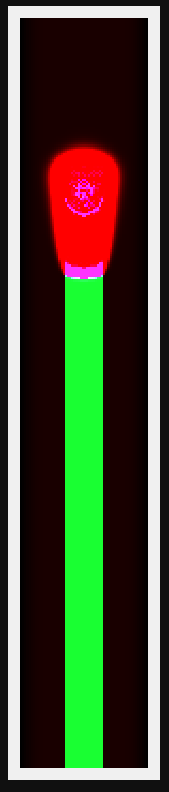

# FEM Candle simulation

### How to run
```
docker compose up
```

### How to view the simulation
Go to http://localhost:5000/

### Colors
- green - solid candle (low temperature)
- blue - flame (high temperature)
- red - temperature\


### Authors:
- Damian Legutko
- Katarzyna Wiater